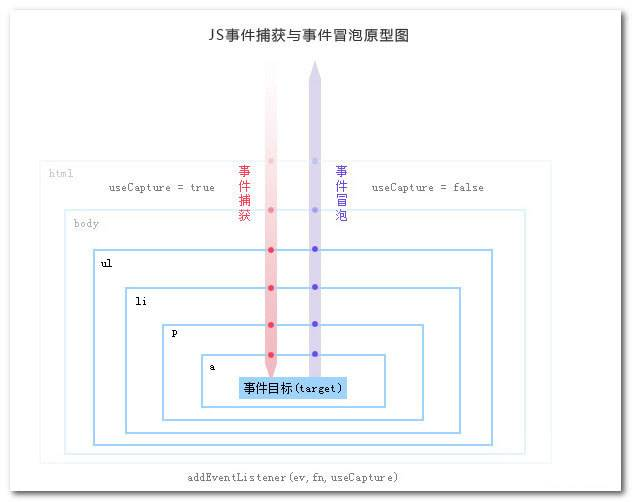

# DOM事件机制
## 一、DOM事件流
DOM事件流指的是
假如在一个button上注册了一个click事件，又在其它父元素div上注册了一个click事件，那么当我们点击button，是先触发父元素上的事件，还是button上的事件呢，这就需要一种约定去规范事件的执行顺序，就是事件执行的流程。

浏览器在发展的过程中出现了两种不同的规范
* IE9以下的IE浏览器使用的是事件冒泡，先从具体的接收元素，然后逐步向上传播到不具体的元素。
* Netscapte采用的是事件捕获，先由不具体的元素接收事件，最具体的节点最后才接收到事件。
* 而W3C制定的Web标准中，是同时采用了两种方案，事件捕获和事件冒泡都可以。
```
// event: 事件名称，可以是标准的DOM事件
// callback: 回调函数，当事件触发时，函数会被注入一个参数为当前的事件对象 event
// useCapture: 默认是false，代表事件句柄在冒泡阶段执行。
element.addEventListener(event, callback, useCapture)
```

## 二、DOM事件模型
DOM事件模型分为捕获和冒泡。一个事件发生后，会在子元素和父元素之间传播（propagation）。这种传播分成三个阶段。
1. 捕获阶段：事件从window对象自上而下向目标节点传播的阶段;
2. 目标阶段：真正的目标节点正在处理事件的阶段;
3. 冒泡阶段：事件从目标节点自下而上向window对象传播的阶段.
具体的捕获和冒泡的过程如下图所示


## 三、事件委托
由于事件会在冒泡阶段向上传播到父节点，因此可以把子节点的监听函数定义在父节点上，由父节点的监听函数统一处理多个子元素的事件。这种方法叫做事件的代理（delegation）。

### 1. 优点
* 减少内存消耗，提高性能

假设有一个列表，列表之中有大量的列表项，我们需要在点击每个列表项的时候响应一个事件
```
<ul id="list">
  <li>item 1</li>
  <li>item 2</li>
  <li>item 3</li>
  ......
  <li>item n</li>
</ul>
```
如果给每个列表项一一都绑定一个函数，那对于内存消耗是非常大的，效率上需要消耗很多性能。借助事件代理，我们只需要给父容器ul绑定方法即可，这样不管点击的是哪一个后代元素，都会根据冒泡传播的传递机制，把容器的click行为触发，然后把对应的方法执行，根据事件源，我们可以知道点击的是谁，从而完成不同的事。

* 动态绑定事件
在很多时候，我们需要通过用户操作动态的增删列表项元素，如果一开始给每个子元素绑定事件，那么在列表发生变化时，就需要重新给新增的元素绑定事件，给即将删去的元素解绑事件，如果用事件代理就会省去很多这样麻烦。

### 2. 如何实现
接下来我们来实现上例中父层元素 #list 下的 li 元素的事件委托到它的父层元素上：
```
document.getElementById('list').addEventListener('click', function (e) {
  // 兼容性处理
  var event = e || window.event;
  var target = event.target || event.srcElement;
  // 判断是否匹配目标元素
  if (target.nodeName.toLocaleLowerCase === 'li') {
    console.log('the content is: ', target.innerHTML);
  }
});
```

## 四、event对象常见的应用
`event. preventDefault()`

如果调用这个方法，默认事件行为将不再触发。什么是默认事件呢？例如表单一点击提交按钮(submit)跳转页面、a标签默认页面跳转或是锚点定位等。

在我的git仓库中也有着一个关于阻止默认事件的小Demo，[点击这里查看](https://github.com/lvzhengyan/JavaScript-demo/blob/master/event/cancelScrollEvent.html)

这是一个阻止滚动条滚动的Demo，同时支持PC和移动端

`event.stopPropagation()`

event.stopPropagation() 方法阻止事件冒泡到父元素，阻止任何父事件处理程序被执行。上面提到事件冒泡阶段是指事件从目标节点自下而上向window对象传播的阶段。